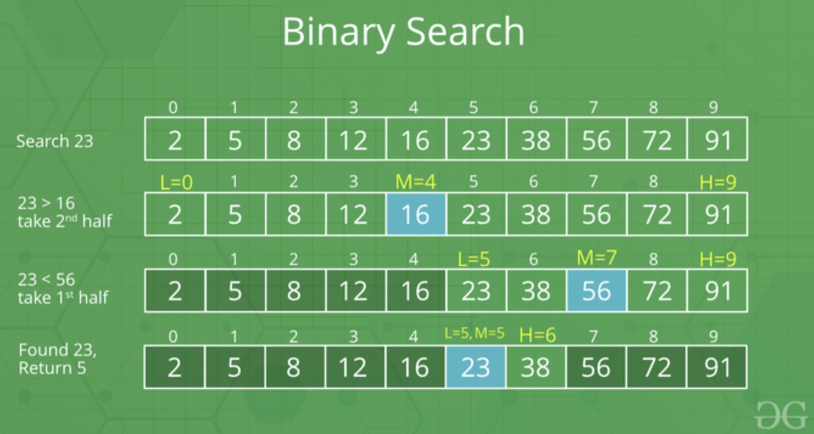
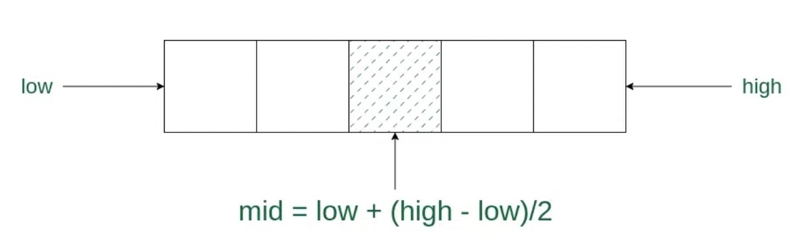

# Binary Search for Swift Developers

This article provides Swift developers with insights into effectively applying the Binary Search technique to tackle a variety of coding challenges.

# Table of Contents

1. [Binary Search](#bs)
    1. [Use Cases](#use_cases)
    1. [Calculating the Middle Index](#middle_index)
        1. [Avoiding Integer Overflow](#overflow)
    1. [Binary Search: Iterative Implementation](#bs_iterative)
    1. [Binary Search: Recursive Implementation](#bs_recursive)
    1. [Binary Search: Most Generalized Implementation](#generalized_algo)
    1. [Time Complexity Calculation](#time_complexity)
    1. [Examples of Binary Search Problems](#examples)
        1. [LeetCode 15. 3Sum](#leetcode_15)
        1. [LeetCode 33. Search in Rotated Sorted Array](#leetcode_33)
1. [References](#references)

# Binary Search <a name="bs"></a>

- **Searching algorithm** used in a **sorted array** by repeatedly **dividing the search interval in half**.
- It uses the following information to reduce the time complexity to `O(log N)`:
    - The array is sorted.
    - Access to any element of the data structure takes constant time.
- It's a **Divide and Conquer** algorithm.
- If the collection is unordered, we can always sort it first before applying Binary Search.
- Very often, in coding challenges, there are the situations where the search space and search target are not so readily available.
    - Sometimes we won't even realize that the problem should be solved with binary search.
    - We might just turn to dynamic programming or DFS and get stuck for a very long time.
    
## Use Cases <a name="use_cases"></a>
- Find single element in a sorted array.
- Find first index satisfying a condition.



## Calculating the Middle Index <a name="middle_index"></a>



### Avoiding Integer Overflow <a name="overflow"></a>

If we calculate `mid` using the below formula overflow (value bigger than max value) can happen:
```swift
let mid = (low + high) / 2
```

```swift
let mid = low + (high – low) / 2
// OR
let mid = high – (high – low) / 2
```

## Binary Search: Iterative Implementation <a name="bs_iterative"></a>

**Problem:**
Find single element in a sorted array.

**Time Complexity:** `O(log n)`

**Space Complexity:** `O(1)`

```swift
func binarySearch(_ nums: [Int], _ target: Int) -> Int {
    
    var left = 0
    var right = nums.count - 1
    
    while left <= right {
        let mid = left + (right - left) / 2
        
        if nums[mid] == target {
            return mid
        } else if nums[mid] > target {
            right = mid - 1
        } else {
            left = mid + 1
        }
    }
    
    return -1
}
```

## Binary Search: Recursive Implementation <a name="bs_recursive"></a>

**Problem:**
Find single element in a sorted array.

**Time Complexity:**
    - Best Case: `O(1)`
    - Average Case: `O(log n)`
    - Worst Case: `O(log n)`

**Space Complexity:** `O(log n)`

```swift
func binarySearch(_ nums: [Int], _ left: Int, _ right: Int, _ target: Int) -> Int {
    
    // Base condition
    if left > right {
        return -1
    }

    let mid = left + (right - left) / 2

    // A target is found
    if nums[mid] == target {
        return mid
    } else if nums[mid] > target {
        return binarySearch(nums, left, mid - 1, target)
    } else {
        return binarySearch(nums, mid + 1, right, target)
    }
}
```

## Binary Search: Most Generalized Implementation <a name="generalized_algo"></a>

**Problem:**
Find first index satisfying a condition.

Challenges for Binary Search Template:
- When to exit the loop? Should we use `left < right` or `left <= right` as the while loop condition?
- How to initialize the boundary variable `left` and `right`?
- How to update the boundary? How to choose the appropriate combination from `left = mid`, `left = mid + 1` and `right = mid`, `right = mid - 1`?

We only need to **modify three parts after copy-pasting this template**, and never need to worry about corner cases and bugs in code any more:
- Correctly **initialize the boundary** variables `left` and `right` to specify search space. 
    - Only one rule: set up the boundary to include all possible elements.
- Decide **return value**. 
    - Is it return `left` or return `left - 1`? 
    - Remember this: after exiting the while loop, `left` is the minimal `k`​ satisfying the condition function.
- Design **the condition function**.

Finding the first index satisfying a condition is the same as finding the first true value of a true-false array.
ex: `[False, ... False, True, ... True]`


**Things to note:**

- `left` and `right` should include and read & write space
- while loop halts when `left == right`
- after the while loop:
    - `left` is the first index satisfying `condition() == true`
    - `left` - 1 is the last index satisfying `condition() == false`


```swift

// Minimize k, condition(k) is True
func binarySearch(_ array: [Int]) -> Int {
    
    var left = min(search_space) // Could be 0 or 1 etc. Depends on problem
    var right = max(search_space) // Could be n or n-1 etc. Depends on problem
    
    while left < right {
        let mid = left + (right - left) / 2
        
        if condition(mid) {
            right = mid
        } else {
            left = mid + 1
        }
    }
    
    // `left` is the minimal k​ satisfying the condition function
    return left // Make sure to return correct value
}

func condition(_ value: Int) -> Bool {}
```

## Time Complexity Calculation <a name="time_complexity"></a>

- We know that at **each step** of the algorithm, our **search space reduces to half**. 
- That means if initially, our search space contains n elements, then after one iteration it contains `n/2`, then `n/4` and so on...
```
n —> n/2 —> n/4 —> … —> 1
```

Suppose our search space is exhausted after `k` steps. Then,
```
n/2k = 1
n = 2k
k = log n
```

## Examples of Binary Search Problems <a name="examples"></a>

### LeetCode 15. 3Sum <a name="leetcode_15"></a>

You can solve [LeetCode 15. 3Sum](https://leetcode.com/problems/3sum/) by using Binary Search:

1. **Sort the array**: This is the initial step which will facilitate the use of binary search and ensure the output triplets are not duplicates. Sorting the array will have a time complexity of `O(n log n)`.

2. **Iterate over the array**: for each index `i` of the array, we'll try to find two other indices `j` and `k`, such that the sum of the values at these indices equals zero. `j` starts as the next index after `i`, and `k` starts as the last index of the array.

3. **Binary Search**: For each `i` and `j`, we calculate the required value to reach the target as (`0 - nums[i] - nums[j]`). Now, we perform binary search on the array to find this value.

Time complexity:
- The sorting operation gives us a time complexity of `O(n log n)`
- The two nested loops contribute a time complexity of `O(n^2)`
    - Within the innermost loop, we perform a binary search contributing a time complexity of `O(log n)`. 
- Thus, the overall time complexity for this solution is `O(n^2 log n)`. 

Although this isn't the most efficient solution for the 3Sum problem (there's an `O(n^2)` solution using **Two Pointers**), it demonstrates how binary search can be applied in scenarios where it may not be immediately obvious to do so.

### LeetCode 33. Search in Rotated Sorted Array <a name="leetcode_33"></a>

We could also take advantage of the Binary Search. But we have to compare the mid value with edges of divided array to decide if we should go with a recursion to the left side or to the right side.

Detailed explanation: [LeetCode 33. Search in Rotated Sorted Array (Python)](https://www.youtube.com/watch?v=U8XENwh8Oy8)

# References <a name="references"></a>
- [Binary Search – Data Structure and Algorithm Tutorials by geeksforgeeks.org](https://www.geeksforgeeks.org/binary-search/)
- [Binary Search Algorithm – Iterative and Recursive Implementation by techiedelight.com](https://www.techiedelight.com/binary-search/)
- [Binary Search Interview Questions & Tips by interviewing.io](https://interviewing.io/binary-search-interview-questions)
- [The 3 Levels of Binary Search - Byte by Byte](https://www.youtube.com/watch?v=nuN3-AkykfM)
