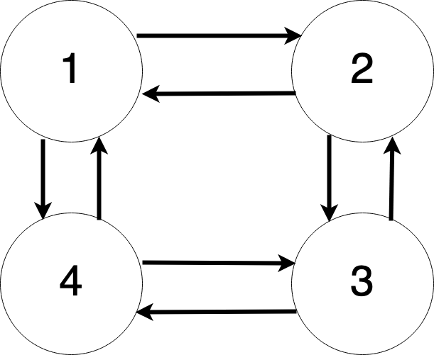

# Table of contents

1. [Dynamic Programming](#dp)
    1. [Overlapping Subproblems Property](#dp_property_1)
    1. [Optimal Substructure Property](#dp_property_2)
1. [Example: Determining the Nth Fibonacci Number](#example_fib)
    1. [The Nth Fibonacci Number Implementation](#example_fib_impl)
1. [Top-Down Dynamic Programming (Memoization)](#memoization)
    1. [Drawbacks of Memoization](#memoization_drawbacks)
    1. [Template for Memoization](#memoization_template)
1. [Bottom-Up Dynamic Programming (Tabulation)](#tabulation)
    1. [Drawbacks of Tabulation](#tabulation_drawbacks)
    1. [Template for Tabulation Algorithm](#example_tabulation)
1. [Memoization vs Tabulation](#memoization_tabulation)
1. [Dynamic Programming vs Other Algorithms](#dp_vs_others)
    1. [Greedy Algorithms](#dp_vs_greedy)
    1. [Divide and Conquer / Binary Search](#dp_vs_divide)
1. [Steps to Solve a Dynamic Programming Problem](#dp_steps)
1. [References](#references)


# Dynamic Programming <a name="dp"></a>

- Dynamic Programming (DP) is an **optimization paradigm** that **finds the optimal solution** (get the minimum/maximum or best/worst) by:
    - **Dividing** the optimization problem into simpler **subproblems**.
    - **Finding** the optimal **solutions** to the subproblems.
    - **Combining** their solutions. 
- DP makes use of **The Principle Of Optimality**:
    - The optimal solution to a optimization problem can be found by combining the optimal solutions to its subproblems.
- DP solves problems using **recursive formulas/structure**: either **recursion** (top-down) or **iteration** (bottom-up).
- **Properties** of problems that can be solved using DP:
    - **Overlapping Subproblems Property**.
        - If the solutions to the same subproblems are needed repetitively for solving the actual problem. 
        - All DP problems satisfy that property.
    - **Optimal Substructure Property**.
        - If the optimal solution of the given problem can be obtained by using optimal solutions of its subproblems.
        - Most of the classic DP problems satisfy that property.
- DP solves some particular type of problems in Polynomial Time `O(n^k)`.

## Overlapping Subproblems Property <a name="dp_property_1"></a>

- When you divide a DP problem into subproblems, you encounter some of them multiple times.
- To address this you should:
    - Solve each subproblem once.
    - Cache its result for future use.
- When the same subproblem occurs again, simply reuse the cached result. There are two techniques for storing subproblem values:
    - **Memoization**.
    - **Tabulation**.
- Caching solutions reduces time complexity but increases space complexity.

## Optimal Substructure Property <a name="dp_property_2"></a>

- The optimal solution of the optimization problem can be found by using the optimal solution to its subproblems instead of trying every possible way to solve the subproblems. 

#### Example: The Shortest Path Problem 

The Shortest Path problem has the following optimal substructure property: 
- Let's consider the shortest path from a source node `U` to destination node `V`.
- The shortest path from `U` to `V` is a combination of the shortest path from `U` to `X` and the shortest path from `X` to `V` (if node `X` lies in the shortest path from `U` to `V`)

The classic All Pair Shortest Path algorithm like Floyd–Warshall and Single Source Shortest path algorithm for negative weight edges like Bellman–Ford are typical examples of Dynamic Programming. 

#### Counterexample: The Longest Path Problem  

On the other hand, the below Longest Path problem (path without cycle) doesn’t have the Optimal Substructure property. 



There are two longest paths from `1` to `3`: `1 -> 2 -> 3` and `1 -> 4 -> 3`. These longest paths do not have the optimal substructure property:
- The longest path `1 -> 2 -> 3` is not a combination of the longest path from `1 -> 2` and the longest path from `2 -> 3`:
    - The longest path from `1 -> 2` is `1 -> 4 -> 3 -> 2`.
    - The longest path from `2 -> 3` is `2 -> 1 -> 4 -> 3`.

# Example: Determining the Nth Fibonacci Number <a name="example_fib"></a>

Function calls in DP can be often represented as a tree to visualize and identify the repeated work:
- You have a main problem (the root of your tree of subproblems)
- And subproblems (subtrees). The subproblems typically repeat and overlap.

```
            == Top of the tree ===

               fib(4)
              /     \
        fib(3)       fib(2)
        /   \        /
    fib(2) fib(1)  fib(1)
    /
fib(1)
           == Bottom of the tree ===
```

Overlapping Subproblems to the above tree:
- `fib(1)` x 3
- `fib(2)` x 2

## The Nth Fibonacci Number Implementation <a name="example_fib_impl"></a>

Both implementations achieve the same result, but the approach used is different. 
- Memoization is a top-down approach that uses recursion.
- Tabulation is a bottom-up approach that uses iteration.

```swift 
// --- Method 1: Brute force recursive solution ---
// Time complexity: `O(2^n)`
// Space complexity: `O(n)`
func fib(_ n: Int) -> Int {
    if n < 2 {
        return n
    }
    return fib(n-1) + fib(n-2)
}

// --- Method 2: Top-Down Dynamic Programming (Memoization) with Dictionary ---
// Time complexity: `O(n)` -> The algorithm computes each Fibonacci number only once and stores the result in an array for future use. 
// Space complexity: `O(n)`
func fib(_ n: Int) -> Int {
    var mem = [Int:Int]()
    return fibMem(n, mem: &mem)
}
private func fibMem(_ n: Int, mem: inout [Int:Int]) -> Int{
    if n == 0 || n == 1 {
        return n
    }

    if mem[n] == nil {
        mem[n] = fibMem(n - 2, mem: &mem) + fibMem(n - 1, mem: &mem)
    }
    
    return mem[n]!
}

// --- Method 3: Bottom-Up Dynamic Programming (Tabulation) ---
// Time complexity: `O(n)`
// Space complexity: `O(n)`
func fibDPTabulation1(_ n: Int) -> Int {
    guard n > 1 else { return n }
    var cache = [0, 1]

    for index in 2...n {
        cache.append(cache[index-1] + cache[index-2])
    }
    return cache[n-1] + cache[n-2]
}

// --- Method 4: Two pointers: old and new state ---
// Time complexity: `O(n)`
// Space complexity: `O(1)`
func fib(_ n: Int) -> Int {
    guard n >= 2 && n <= 30 else { return n }
    var prev = 0, next = 1
    for _ in 2...n {
        (prev,next) = (next, prev + next)
    }
    return next
}
```

# Top-Down Dynamic Programming (Memoization) <a name="memoization"></a>

- We implement a solution using **recursive** approach.
- We **cache the result of a recursive function call** in an array or hash table (dictionary).
    - As a result we **avoid making the same call again** in future.

#### Drawbacks of Memoization <a name="memoization_drawbacks"></a>

- The problem is that Memoization can cause the **stack overflow error** if the input size is too big.
- We need an `O(1)`-access memory structure.
- Recursive calls kept on a stack increase **space complexity**.

#### Example of Memoization <a name="example_memoization"></a>

Here's Memoized version to find factorial of `x`:

```swift

// 1. Create a memo object
let n = MAXN
var dp = [Int](repeating: -1, count: n + 1) 

func factorial(_ x: Int) -> Int {
    
    // 2. Handle the base case
    if x == 0 { 
        return 1
    }
    
    // 3. Check if exists in the memo
    if dp[x] != -1 {
        return dp[x]
    }
    
    // 4. Compute
    dp[x] = x * factorial(x - 1)
    
    // 5. Return
    return dp[x]
}
```

#### Template for Memoization Algorithm <a name="memoization_template"></a>

1. **Create a memo object** to store the cached results of the function:

- **The key** 
    - Should be the input parameters to the function.
    - Represents the current subproblem.
- **The value**
    - Represents the previously calculated subproblem's solution.
- A dictionary is a perfect for this due to its fast access times (`O(1)`).

2. **Handle the base case** of a recursion at the beginning of the function / solution.

3. **Check** if the input parameters are already **exists in the cache dictionary**:

- If they are, return the cached result.
- Otherwise, go to the next step.

4. **Compute** the result and **cache** it in the dictionary with the input parameters as the key.

5. Return the computed result.


# Bottom-Up Dynamic Programming (Tabulation) <a name="tabulation"></a>

- It's just the **reverse** to the **top-down approach.**
- We implement a solution using **iterative** approach.
- It starts from **the base cases** and finds the optimal solutions to the problems whose immediate sub-problems are the base cases.
- It sorts the subproblems by their input size and solves them iteratively in the order of smallest to the largest.
- Then, it goes one level up and combines the solutions it previously obtained to construct the optimal solutions to more complex problems.

#### Drawbacks of Tabulation <a name="tabulation_drawbacks"></a>

- Sometimes it's hard to figure out iterative solution, it's easier to implement recursion.

#### Example of Tabulation <a name="example_tabulation"></a>

Here's tabulated version to find factorial of `x`:

```swift
func factorial(_ n: Int) {
    // 1. Create an array
    let n = MAXN
    var dp = [Int](repeating: 0, count: n + 1)

    // 2. Handle the base case
    dp[0] = 1

    for i in 1...n {
        // 4. Compute
        dp[i] = dp[i - 1] * i
    }
    
    // 5. Return
    return dp[n]
}
```

#### Template for Tabulation Algorithm <a name="memoization_template"></a>

1. **Create an array** to store the cached results of the function.

2. **Handle the initial/base case** by defining solutions for the first elements in the array.

3. **Iterate** through the array and **calculate next elements** in the array using a recursive formula.

4. Return the computed result.

# Memoization vs Tabulation <a name="memoization_tabulation"></a>

|   | Top-down (Memoization) | Bottom-up (Tabulation) |
|---|---|---|
| **Start point** | The last case (e.g. `fib(n)`) - the biggest subproblem | The base cases (e.g. `fib(0)`)- the smallest subproblems |
| **Algorithm** | 1. Define subproblems<br/>2. Define the base case | 1. Define iterative order to fill the table<br/>2. Take care of boundary conditions |
| **Complexity** | Easier | Harder (it's hard to define iterative order) |
| **State transition** | Easy to think | Difficult to think |
| **Code** | Easy | Gets complex when a lot of conditions are required |
| **Implementation type** | **Recursive** | **Iterative**  |
| **Overlapping subproblems?** | Yes | No |
| **Saving results** | Caches the results of function calls in **dictionary** | Stores the results of subproblems in a **array** |
| **Well-suited for problems** | With a relatively **small** set of inputs | With a **large** set of inputs |
| **Speed** | Slow | Usually faster (no recursion call stack)|
| **DS entries** | Fill on demand (might not fill all entries) | Starting from first entry, all entries are filled one by one |

# Dynamic Programming vs Other Algorithms <a name="dp_vs_others"></a>

### Greedy Algorithms <a name="dp_vs_greedy"></a>

- Greedy Algorithms are also used to **solve optimization problems**.
    - If the problem requires **finding an optimal solution** - use **Dynamic Programming**.
        - We do it by finding **all possible solutions** and then **picking the optimal** solution.
    - If the problem requires **any correct solution** - use **Greedy Algorithms**.
- Greedy Algorithms:
    - We follow **predefined procedure** to get the **optimal result**.
    - The predefined procedure is known to be optimal.
    - Examples of predefined procedures:
        - Always select minimum cost.
        - Always select shortest path.
- Decision to get the optimal solution is taken once (the opposite to the Dynamic Programming).
- Dynamic Programming is more time consuming than Greedy Algorithms.

### Divide and Conquer / Binary Search <a name="dp_vs_divide"></a>

- Like Divide and Conquer, Dynamic Programming combines solutions to subproblems. 
- Dynamic Programming is mainly used when we have **overlapping subproblems**.
    - For example, Binary Search doesn’t have overlapping subproblems.

# Steps to Solve a Dynamic Programming Problem <a name="dp_steps"></a>

1. **Identify if it is a Dynamic Programming problem.**

- Look for Dynamic Programming properties:
    - All DP problems satisfy the **Overlapping Subproblems Property**.
        - While working on a brute-force solution you notice that it consists of smaller subproblems.
        - There is a **recursion** with a base case.
    - Most of the DP problems also satisfy the **Optimal Substructure Property**.
        - The **minimum/maximum out of a set** of possible options.
        - The **best/worst of a set** of possible options.
        - The **total number of options/problems**.

This isn't confirmation that dynamic programming is suitable, or even that's the best approach, but it is a good signal that DP is worth exploring.

2. **Define the state.**

Example 1:

In classic Knapsack problem, we define our state by two parameters index and weight i.e. `dp[index][weight]`. Here `dp[index][weight]` tells us the maximum profit it can make by taking items from range 0 to index having the capacity of sack to be weight. Therefore, here the parameters index and weight together can uniquely identify a subproblem for the knapsack problem.

Example 2:

*Given 3 numbers {1, 3, 5}, The task is to tell the total number of ways we can form a number N using the sum of the given three numbers. (allowing repetitions and different arrangements).*

Let's define `f(n)` = the total number of arrangements to form `n` by using `{1, 3, 5}` as elements.

Let's create a tree structure to find a recursive relationship:

```
                                                          f(6)
                                            /               |                 \
                                           
                                         f(5)              f(3)                f(1)
                                                        from memo: +2
                                         
                                      /    |    \                            /   |   \
                                      
                                 f(4)    f(2)   f(0)                       f(0) f(-2)  f(-4)
                                 
                            /     |   \   [memo: +1]  [memo: +1]        [memo: +1] 
                            
                        f(3)     f(1)   f(-1)
                        
                    /     |     [memo: +1]
                    
                f(2)      f(0)
            /    |     \   [memo: +1]
            
        f(1)   f(-1)  f(-3)   
        
     /    |    \
     
   f(0) f(-2)  f(-4)
   [+1]
```

3. **Define transition between previous states and the current state.** 

Therefore, we can say that result for:<br/>
`f(6) = f(5) + f(3) + f(1)`<br/>
or, using `n`:<br/>
`f(6) = f(6-1) + f(6-3) + f(6-5)`<br/>
In general:<br/>
`f(n) = f(n-1) + f(n-3) + f(n-5)`

Implementation:
```swift
// Time Complexity: `O(3^n)`
// Space Complexity : `O(n)` (the recursion call stack)

func f(_ n: Int) -> Int {
    // Base case
    if n < 0 {
        return 0
    }
    if n == 0 {
        return 1
    }
    
    return solve(n - 1) + solve(n - 3) + solve(n - 5)
}
```

4. **Do tabulation or memorization.**

```swift
// Initialize an array with -1 values
var memo = Array(repeating: -1, count: MAXN)

// This function returns the number of arrangements to form 'n'
func solve(_ n: Int) -> Int {
    // Base case
    if n < 0 {
        return 0
    }
    if n == 0 {
        return 1
    }
    
    // Check if the result is already calculated
    if memo[n] != -1 {
        return memo[n]
    }
    
    // Calculate and store the result
    memo[n] = solve(n - 1) + solve(n - 3) + solve(n - 5)
    
    return memo[n]
}
```

# Classic Dynamic Programming Problems 

- 0-1 Knapsack Problem
- Coin Change
- Longest Common Subsequence
- Longest Increasing Subsequence
- Longest Palindromic Subsequence
- Min Cost Path
- Matrix Chain Multiplication
- Palindrome Partitioning

# References <a name="references"></a>

- https://interviewing.io/dynamic-programming-interview-questions
- https://www.programiz.com/dsa/dynamic-programming
- https://www.geeksforgeeks.org/solve-dynamic-programming-problem/
- https://www.geeksforgeeks.org/overlapping-subproblems-property-in-dynamic-programming-dp-1/
- https://www.geeksforgeeks.org/tabulation-vs-memoization/
- https://www.geeksforgeeks.org/what-is-memoization-a-complete-tutorial/
- https://www.enjoyalgorithms.com/blog/top-down-memoization-vs-bottom-up-tabulation
- https://stackoverflow.com/questions/6164629/what-is-the-difference-between-bottom-up-and-top-down
- https://labuladong.gitbook.io/algo-en/i.-dynamic-programming
- https://www.baeldung.com/cs/tabulation-vs-memoization
