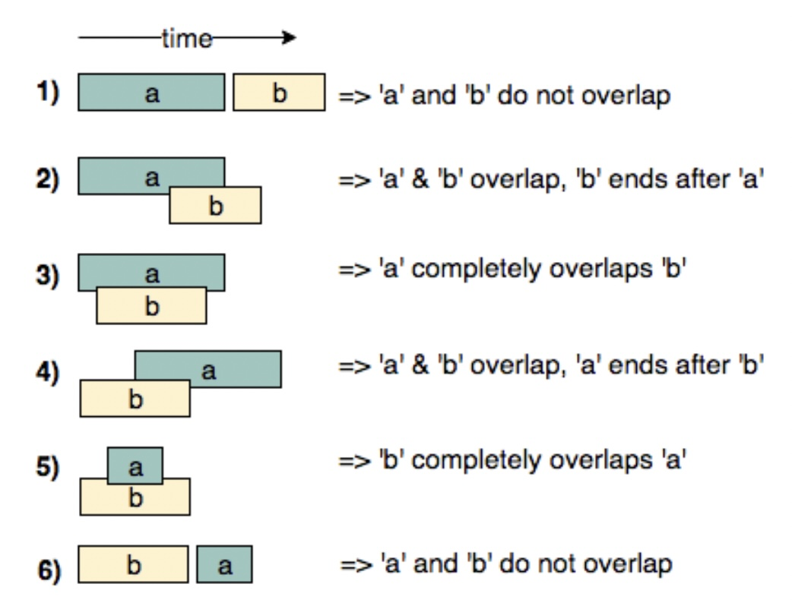

# Merge Intervals for Swift Developers

This article provides Swift developers with insights into effectively applying the Merge Intervals technique to tackle a variety of coding challenges.

# Table of Contents

1. [Merge Intervals Technique](#merge_intervals_technique)
1. [Swift Helper Functions for Solving Merge Intervals Problems](#helpers)
1. [Example - Merge Intervals Sorting](#example)
1. [References](#references)

# Merge Intervals Technique <a name="merge_intervals_technique"></a>

This pattern describes an efficient technique to deal with overlapping intervals. In a lot of problems involving intervals, we either need to find overlapping intervals or merge intervals if they overlap.

Given two intervals (`a` and `b`), there will be six different ways the two intervals can relate to each other:
1. `a` and `b`do not overlap
2. `a` and `b` overlap, `b` ends after `a`
3. `a` completely overlaps `b`
4. `a` and `b` overlap, `a` ends after `b`
5. `b` completly overlaps `a`
6. `a` and `b` do not overlap

Understanding the above six cases will help us in solving all intervals related problems.


# Swift Helper Functions for Solving Merge Intervals Problems <a name="helpers"></a>

```swift
// Note: equality in the below code should be adjusted to the requirements of the coding challange.

extension Array where Element == Int {
    
    // 1st case from the above image
    func isBeforeThan(b: [Int]) {
        guard self.count != 2, b.count != 2 { return false }
        let end = self[0]
        let b_start = b[0]
        return end < b_start
    }
    
    // 2nd case from the above image
    func wrapsStartOf(b: [Int]) {
        guard self.count != 2, b.count != 2 { return false }
        let start = self[0]
        let end = self[1]
        let b_start = b[0]
        let b_end = b[1]
        return 
            b_start > start && b_start < end
            && b_end > end
    }
    
    // 3rd case from the above image
    func completelyOverlaps(b: [Int]) {
        guard self.count != 2, b.count != 2 { return false }
        let start = self[0]
        let end = self[1]
        let b_start = b[0]
        let b_end = b[1]
        return start < b_start && end > b_end
    }
    
    // 4th case from the above image
    func wrapsEndOf(b: [Int]) {
        guard self.count != 2, b.count != 2 { return false }
        let start = self[0]
        let end = self[1]
        let b_start = b[0]
        let b_end = b[1]
        return 
            b_end > start && b_end < end
            && b_start < start
    }
    
    // 5th case from the above image
    func isIn(b: [Int]) {
        guard self.count != 2, b.count != 2 { return false }
        let start = self[0]
        let end = self[1]
        let b_start = b[0]
        let b_end = b[1]
        return start > b_start && end < b_end
    }

    // 6th case from the above image
    func isAfterThan(b: [Int]) {
        guard self.count != 2, b.count != 2 { return false }
        let start = self[]
        let b_end = b[1]
        return start > b_end
    }
}
```

# Example - Merge Intervals Sorting <a name="example"></a>

[LeetCode - 56. Merge Intervals](https://leetcode.com/problems/merge-intervals/)

*Given an array of intervals where intervals[i] = [start_i, end_i], merge all overlapping intervals, and return an array of the non-overlapping intervals that cover all the intervals in the input.*

```swift
func merge(_ intervals: [[Int]]) -> [[Int]] {
    
    // 1. Sort by a start of an interval
    let sorted = intervals.sorted(by: { $0[0] < $1[0] })
    guard let first = sorted.first else { return [[Int]]() }

    // 2. Add first interval to the result
    var result = [first]
    
    // 3. We iterated through intervals sorted by their start
    for b in sorted {
        
        // 4. We take the last interval from result
        guard let a = result.last else { continue }

        // 5. Define start & end for the previous intervals
        let a_start = a[0]
        let a_end = a[1]
        
        // 6. Define start & end for the current intervals
        let b_start = b[0]
        let b_end = b[1]
        
        // 7. Check if intervals overlap
        if a_end >= b_start { // a & b overlap: override the last interval end
            result[result.count - 1] = [a_start, max(a_end, b_end)]
        } else { // a & b do not overlap overlap
            result.append(b)
        }
    }
    return result
}
```

# References <a name="references"></a>

- [Pattern 4: Merge Intervals](https://github.com/Chanda-Abdul/Several-Coding-Patterns-for-Solving-Data-Structures-and-Algorithms-Problems-during-Interviews/blob/main/%E2%9C%85%20%20Pattern%2004%20:%20Merge%20Intervals.md)
- [Merge Intervals - Sorting - Leetcode 56 by NeetCode](https://www.youtube.com/watch?v=44H3cEC2fFM)
